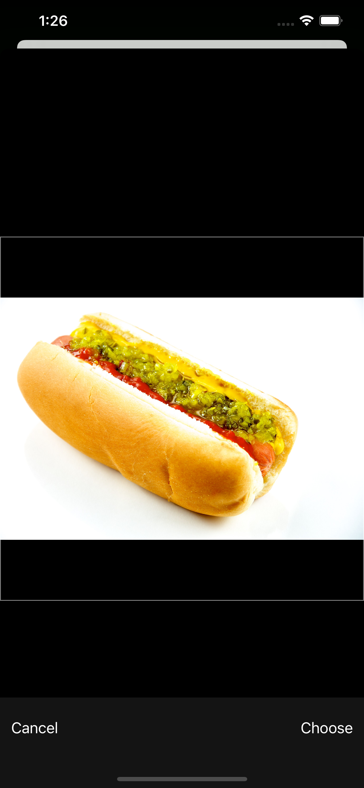
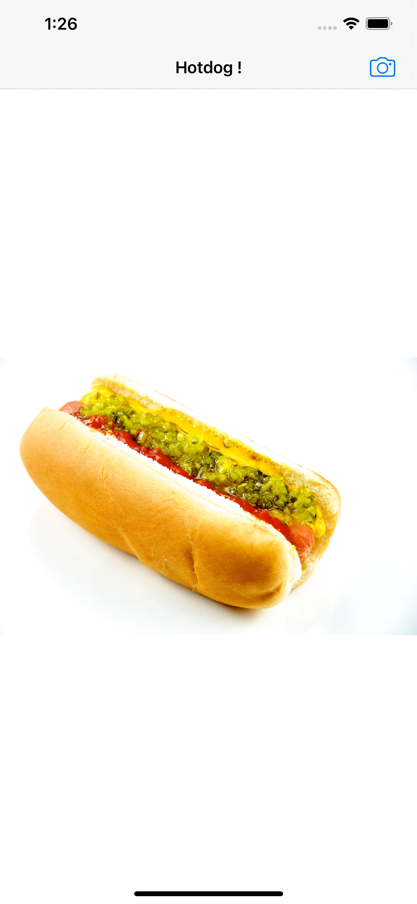
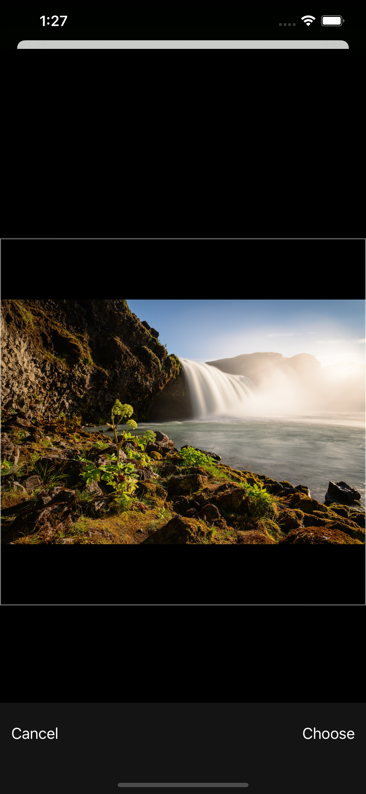
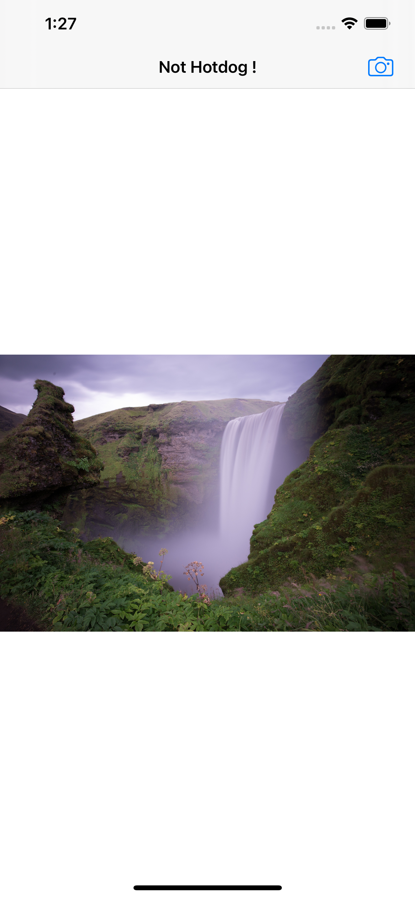

    

# SeaFood

## What is it ?

* It is anapplication to classify food items into Hotdog or not Hotdog, implemented using Swift5 and XCode. 
* Use of CoreML from Apple Architecture.
* Use of Binary Classification. 
* Use of Inceptionv3.mlmodel.

## App Screenshots

 |  ( Home Screen ) |  (Selecting Photo) |  (Editing Photo)|
 |:---:|:---:|:---:|
 
 | (Hotdog) | ( Again Selecting ) | ( Not Hotdog ) | 
 |:---:|:---:|:---:|
 

